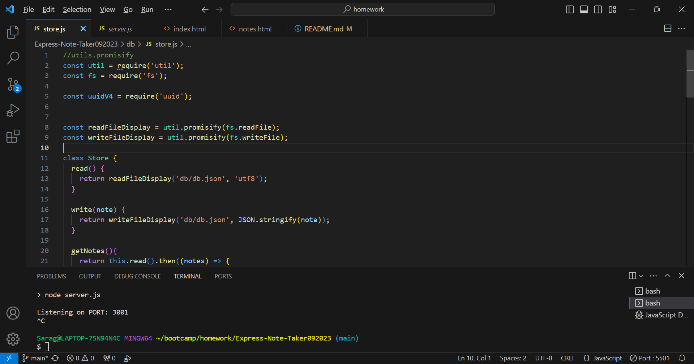
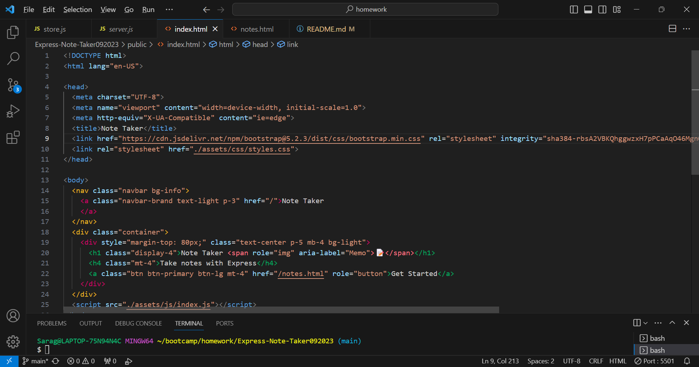
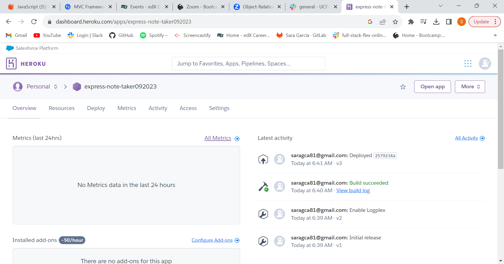

# Express-Note-Taker092023

## Description
This app will help you organize you day, week or month.  You can add notes as reminders so you will never miss another appointment. With a little more time I would like to add code to set reminders and alarms to also remind you when you have an upcoming event. For this app I learned how to tie front end and backend together. It's not perfect, but I will continue to learn as we go along.

## Installation
Simply type npm start and the app with do the rest.

## Usage

 /* Let me know if I am suppose to do something else so you know it was deployed through Heroku*/

## Credits
I had help from a tutor: Sandy Smith

## License
Please see Github for information regarding license.